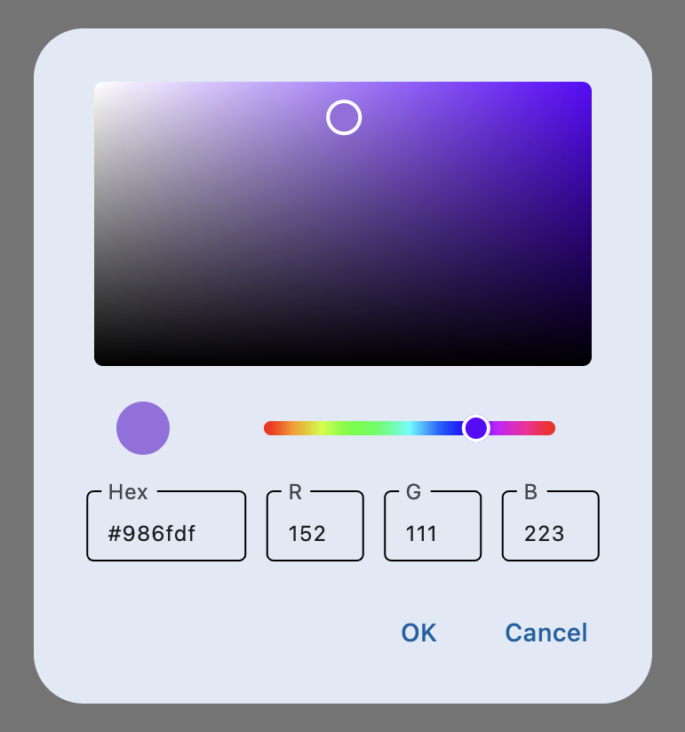

# ColorPicker

`ColorPicker` control is used for picking a color from color map in hex (rgb) format.

`ColorPicker` inherits from [`Column`](https://flet.dev/docs/controls/column) and can be used as a content for [`AlertDialog`](https://flet.dev/docs/controls/alertdialog) or other control or placed directly on a page.

## Examples

[Live example](https://flet-controls-gallery.fly.dev/contrib/colorpicker)

### ColorPicker dialog



```python
import flet as ft

from flet_contrib.color_picker import ColorPicker

def main(page: ft.Page):
    def open_color_picker(e):
        d.open = True
        page.update()

    color_picker = ColorPicker(color="#c8df6f", width=300)
    color_icon = ft.IconButton(icon=ft.icons.BRUSH, on_click=open_color_picker)

    def change_color(e):
        color_icon.icon_color = color_picker.color
        d.open = False
        page.update()

    def close_dialog(e):
        d.open = False
        d.update()

    d = ft.AlertDialog(
        content=color_picker,
        actions=[
            ft.TextButton("OK", on_click=change_color),
            ft.TextButton("Cancel", on_click=close_dialog),
        ],
        actions_alignment=ft.MainAxisAlignment.END,
        on_dismiss=change_color,
    )
    page.dialog = d

    page.add(color_icon)

ft.app(target=main)
```

## Properties

### `color`

[Color](https://flet.dev/docs/guides/python/colors#hex-value) in hex value format. The default value is `#000000`.

### `width`

Width of `ColorPicker` in virtual pixels that can be specified when creating a `ColorPicker` instance. The default value is `340`.
